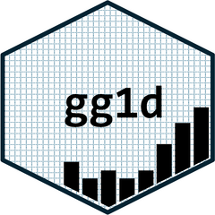

# interactiveEDA 

<!-- badges: start -->
[](https://lifecycle.r-lib.org/articles/stages.html#experimental)
[](https://github.com/CCICB/interactiveEDA/actions/workflows/R-CMD-check.yaml)
<!-- badges: end -->

A browser-based graphical user interface for interactive exploratory data analysis, 
powered by the '[ggEDA](https://github.com/CCICB/ggEDA)' package. 
Designed for non-programmers, it allows users to explore complex multi-variable relationships, 
visualize patterns of missing data, and create publication-ready parallel coordinate plots 
and tiled one-dimensional graphics — all without writing a single line of code.

## Quick Start

Start using the web-app hosted [here](https://CCICB.github.io/interactiveEDA)


### Running interactiveEDA offline:

You can install interactiveEDA as an R package from [GitHub](https://github.com/) with:

``` r
# install.packages("pak")
pak::pak("CCICB/interactiveEDA")
```

Once installed, run the app locally:

``` r
library(interactiveEDA)
run_app()
```

interactiveEDA will open in your default browser.


## For Developers

### Creating a web-assembly app

interactiveEDA is developed as a golem app, which by default cannot  be compiled to webassembly
because it lacks the required "app.R" file. We have added this file to the package root directory so
web-assembly compilation can be accomplished using `shinylive::export(".", "_site")`.

To auto-compile and deploy the web-assembly app version: use the deploy-app.yaml.


If this doesn't work, we can try the following [shiny-live github action](https://github.com/ThinkR-open/golem-shinylive/blob/main/.github/workflows/shiny-live.yml)


## Code of Conduct

Please note that the interactiveEDA project is released with a [Contributor Code of Conduct](https://contributor-covenant.org/version/2/1/CODE_OF_CONDUCT.html). By contributing to this project, you agree to abide by its terms.
